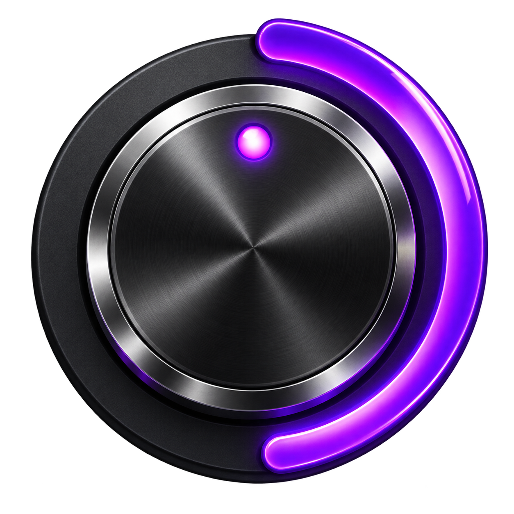
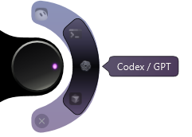

<div align="center">



# AIHub

**Seus aplicativos a um giro de distância.**

Um launcher radial para Windows que fica na lateral da tela, abre com o mouse e recolhe quando você termina.


[Começar](#começar) · [Como usar](#como-usar) · [Desenvolvimento](#desenvolvimento)

</div>

## Pequeno na tela. Pronto para abrir.

Role para selecionar. Clique para abrir. Ao tirar o mouse, o hub recolhe com uma animação curta e deixa um botão com neon violeta pulsante junto à borda.

<div align="center">
<table>
<tr><th>Aberto</th><th>Recolhido</th></tr>
<tr>
<td></td>
<td></td>
</tr>
</table>
<sub>Capturas da interface real. Os ícones dependem dos aplicativos instalados.</sub>
</div>

| Recurso | No dia a dia |
| --- | --- |
| Seleção radial | Percorra aplicativos com o scroll |
| Atalhos por arraste | Solte `.exe` ou `.lnk` sobre o hub |
| Ordem por arraste | Segure um ícone e mova para cima ou para baixo |
| Recolhimento imediato | Libere a tela ao tirar o mouse |
| Neon pulsante | Encontre o botão junto à borda |
| Ocultação em tela cheia | Mantenha o hub fora do caminho |
| Posição ajustável | Escolha lateral, altura e monitor |

O AIHub é um launcher local: não fornece modelos de IA, não pede chaves de API e não substitui os aplicativos que abre.

## Começar

Você precisa do **Windows** e do [.NET SDK 10](https://dotnet.microsoft.com/download/dotnet/10.0).

```powershell
git clone https://github.com/Emansecio/aihub.git
cd aihub
dotnet build .\AIHub.csproj -c Release
Start-Process .\bin\Release\net10.0-windows\AIHub.exe
```

O executável gerado depende do **.NET Desktop Runtime 10**. Ao copiar a compilação para outro computador, mantenha os arquivos da pasta de saída juntos. O repositório contém o código-fonte; não há instalador incluído.

O catálogo inicial inclui **Codex / GPT, Cursor, Hermes, Grok Bot e Terminal**. Essas entradas dependem dos aplicativos e atalhos instalados no computador; o hub não os instala. Para outras instalações, adicione um atalho personalizado. Entradas indisponíveis exibem erro ao abrir.

## Como usar

- Role o mouse sobre o botão ou o arco para escolher Codex / GPT, Cursor, Hermes, Grok Bot ou Terminal.
- Clique no botão circular para abrir a seleção. Se uma janela existente puder ser ativada, ela é trazida para frente.
- Clicar em um ícone apenas seleciona aquele aplicativo.
- Para **reorganizar**, segure um ícone do arco e arraste para cima ou para baixo. Os outros ícones mudam de posição; segurar perto de uma extremidade avança pela lista a cada 450 ms. Solte para salvar a ordem e manter o aplicativo arrastado selecionado. `Esc` cancela a troca; um clique simples continua apenas selecionando e o scroll continua navegando.
- Ao tirar o mouse do hub, ele começa a recolher **imediatamente**, com animação de 360 ms. O botão recolhido tem cerca de **57 px**, com contorno e brilho neon violeta. Passar o mouse expande novamente ao tamanho atual. A animação pode ser interrompida suavemente; menus, arraste e seleção de arquivo suspendem o recolhimento. Ao abrir o programa ou revelá-lo pelo atalho, há 3 segundos para alcançar o hub com o mouse.
- O **Terminal** abre pelo atalho registrado do Windows, sem argumentos ou comandos enviados pelo hub. Ele segue as configurações de inicialização do próprio Terminal; você escolhe a pasta e executa seus comandos normalmente.
- Para acrescentar outros aplicativos: botão direito no hub → **Adicionar atalho…** → escolha um `.exe` ou `.lnk`. Atalhos do Windows mantêm seus próprios argumentos e pasta inicial. O hub continua do mesmo tamanho, mostrando quatro ícones por vez durante o scroll.
- Você também pode **arrastar um ou mais arquivos `.exe` ou `.lnk` sobre o botão**, mesmo recolhido. O hub cadastra os atalhos sem abrir, mover ou copiar os arquivos. Duplicados são reutilizados; lotes com outras extensões são recusados e arquivos indisponíveis exibem erro.
- O hub **se oculta automaticamente em tela cheia** quando o aplicativo em primeiro plano cobre o monitor do hub e volta ao sair, sem tomar o foco. A verificação ocorre a cada 750 ms. Janelas comuns maximizadas e tela cheia em outro monitor não acionam a ocultação. Se você ocultar o hub manualmente, ele permanece oculto até ser reaberto pelo atalho ou pela bandeja.
- **Remover atalho do hub** retira uma opção adicionada por você, sem apagar o aplicativo ou o arquivo original.
- Arraste a parte exposta da base preta, junto à borda da tela, para ajustar a altura.
- Botão direito: escolher lateral, monitor, centralizar, ocultar ou sair.
- **Ctrl + Alt + Espaço** mostra/oculta o hub, quando o atalho está disponível. O ícone na bandeja também permite reabrir.
- A janela do hub fica fora do **Alt+Tab** e da barra de tarefas; o acesso permanece pela bandeja e pelo atalho global.
- Com o hub em foco, use as setas para escolher, Enter/Espaço para abrir e Esc para ocultar.

### Preferências locais

O programa salva a seleção, a ordem dos aplicativos, os atalhos personalizados, a lateral, o monitor e a altura em `%LOCALAPPDATA%\AIHub\settings.json`. Esses dados e os atalhos particulares não acompanham o repositório. Abrir o executável novamente solicita a exibição da instância já aberta.

### Iniciar com o Windows

Depois de escolher uma pasta permanente para a compilação:

1. Pressione `Win + R`, digite `shell:startup` e confirme.
2. Crie nessa pasta um **atalho para `AIHub.exe`**.

Isso habilita a inicialização ao entrar no Windows para seu usuário. Para desativá-la, remova apenas esse atalho. Compilar o código-fonte não configura a inicialização automaticamente.

O ícone próprio, criado com Imagegen, está incorporado ao executável e à bandeja. O [PNG original e o prompt](Assets/README.md) acompanham o projeto; `Assets/AIHub.ico` contém versões de 16 a 256 px para o Windows.

## Desenvolvimento

| Arquivo | Responsabilidade |
| --- | --- |
| `HubWindow.xaml` | Interface e formas vetoriais |
| `HubWindow.xaml.cs` | Interações, animações e visibilidade |
| `AppCatalog.cs` | Descoberta e abertura dos aplicativos |
| `FullScreenDetector.cs` | Detecção de tela cheia |
| `Selection.cs` | Seleção circular e scroll de precisão |
| `Settings.cs` | Preferências locais |
| `NativeMethods.cs` | Integrações Win32 |
| `tests/Program.cs` | Verificações de comportamento e interface |

O neon pulsa em um ciclo de 2,8 segundos, limitado a 20 quadros por segundo, apenas quando recolhido e visível. O contorno permanece vetorial, com prioridade de qualidade no brilho; a pulsação para ao expandir, ocultar ou encerrar. Quando o Windows desativa animações, o contorno fica estático. O movimento dos ícones usa transformação visual sem recalcular o layout a cada quadro.

```powershell
dotnet build .\AIHub.csproj -c Release
dotnet run --project .\tests\AIHub.Tests.csproj -c Release
# Verifica arraste de atalhos, tela cheia e recolhimento:
dotnet run --project .\tests\AIHub.Tests.csproj -c Release -- --features-only
# Verifica a abertura real do Terminal:
dotnet run --project .\tests\AIHub.Tests.csproj -c Release -- --launch-terminal
# Também abre/ativa todos os aplicativos locais:
dotnet run --project .\tests\AIHub.Tests.csproj -c Release -- --launch-installed
```

C# / WPF sobre .NET 10, sem pacotes NuGet externos. Janela transparente e sempre visível sobre janelas normais, sem ocupar espaço na barra de tarefas. A bandeja usa Windows Forms. A implementação segue a [documentação de janelas WPF da Microsoft](https://learn.microsoft.com/en-us/dotnet/desktop/wpf/windows/).

Os aplicativos são resolvidos pelos atalhos locais do menu Iniciar/desktop. O Codex / GPT usa a identidade registrada `OpenAI.Codex_2p2nqsd0c76g0!App` para não depender da pasta versionada do pacote. Essa identidade foi validada na instalação de desenvolvimento; instalações diferentes podem precisar de um atalho personalizado. Os ícones são lidos dos executáveis locais.

Os testes exercitam seleção circular, scroll de precisão, separação entre selecionar e abrir, proteção contra duplo clique, teclado, transparência nativa, erros de abertura e restauração da seleção. A opção `--launch-installed` verifica também a presença de uma janela nativa de cada aplicativo após o clique; isso não verifica login ou disponibilidade dos serviços de IA.

### Validação e limites conhecidos

Feche a instância do AIHub antes de recompilar para evitar bloqueio do executável pelo Windows. Os testes consultam aplicativos instalados e abrem janelas nativas: exigem uma sessão interativa e não são uma suíte portátil de CI. Os modos `--launch-terminal` e `--launch-installed` abrem aplicativos reais.

Na validação local mais recente, o modo `--features-only` passou em **64 verificações**. A integração com foco real ficou não validada porque o Windows não concedeu primeiro plano à janela de teste. Há uma falha anterior, ainda não diagnosticada, na checagem de clique nativo da suíte completa.

Tela segura do Windows e aplicativos em tela cheia exclusiva podem encobrir o hub. Posicionamento entre monitores com escalas diferentes está implementado, mas requer validação nesse tipo de configuração. A detecção considera janelas sem borda de título cobrindo o monitor. Ocultar manualmente prevalece sobre o retorno automático; enquanto houver tela cheia detectada, uma solicitação de reabertura aguarda sua saída.

Os testes de arraste exercitam os eventos WPF com arquivos locais; não automatizam o Explorador. A detecção de tela cheia usa os limites visíveis de uma janela nativa sem borda e o monitor selecionado. O teste sinaliza quando o Windows não concede primeiro plano à janela de teste, impedindo verificar essa integração com foco real. Jogos exclusivos e apresentações de terceiros não foram exercitados. Referências: [arraste no WPF](https://learn.microsoft.com/en-us/dotnet/desktop/wpf/advanced/drag-and-drop-overview) e [limites visíveis de janelas](https://learn.microsoft.com/en-us/windows/win32/api/winuser/nf-winuser-getwindowrect).

## Créditos

Os nomes e marcas dos aplicativos pertencem aos respectivos titulares. O AIHub não é afiliado aos aplicativos listados.
